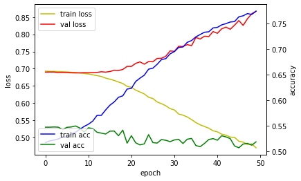
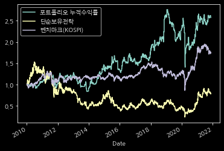

# KQR-Backtesting-Project
: KQR Backtesting Project Repository

**KQR (Korea Univ. Quant Research)**

*2021.09 ~ 2022.01*

## Project 1
### 강환국의 슈퍼 가치 전략
#### 매수전략 
1. 한국 시가총액 하위 20% 주식을 대상으로 PBR, PCR, PER, PSR 각각 순위를 매김
2. 네 개 지표의 순위를 더해 통합 순위 작성
3. 통합 순위가 높은 종목 50개 매수
#### 매도전략
* 연 1회 리벨런싱
#### 기대 CAGR 
* 25% 이상  

## Project 2
### CNN을 활용한 candle chart 예측 
#### Intro
<[https://arxiv.org/pdf/1903.12258.pdf](https://arxiv.org/pdf/1903.12258.pdf)>

* 위의 논문을 바탕으로 candle chart 예측 모델 구현
* 논문에서는 Taiwan과 Indonesia의 주식 시장 데이터를 활용하여 작성하였지만 이번 프로젝트에선 한국 주식 시장의 데이터를 활용하여 적용

#### 학습 결과

* 위에서 볼 수 있듯이 overfitting이 일어났음을 확인할 수 있음
* Colab의 성능 한계 때문에 논문에서 제시한 stock data의 기간과 기업의 수를 동일하게 맞춰서 데이터를 구성하지 못 했던 점이 가장 큰 원인이라고 생각함

#### Backtesting 결과

* 벤치마크보단 높은 수익률을 보여주고 있긴 함
* 프로젝트 발표에서 다음날 종가의 상승/하락 여부에 따라 매수/매도만 판단해서 backtesting을 진행한 점이 아쉽다는 지적을 받음
* 매수/매도/보유, 이렇게 세 classes로 나누어 backtesting을 진행했으면 더 나은 결과를 도출할 수 있었을 것임